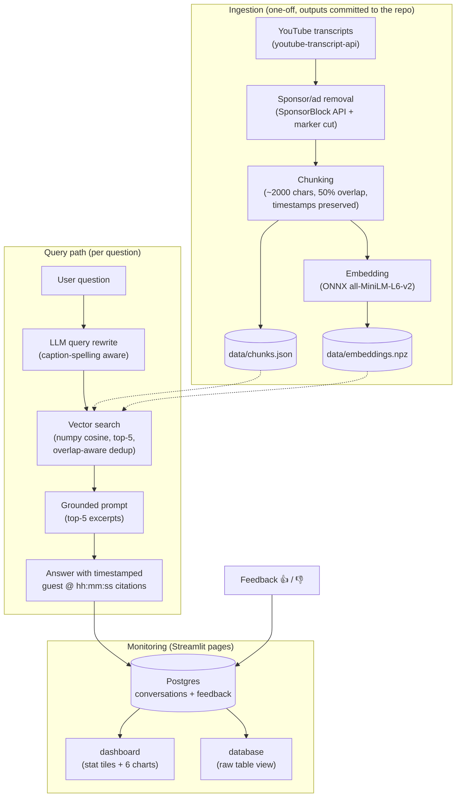

# fusion-rag

Ask three fusion experts anything. A retrieval-augmented generation (RAG)
application over the transcripts of three Lex Fridman podcast episodes on
nuclear fusion. Every answer cites the exact moment in the episode, so you
can jump into the video and hear the expert say it.

## Why I built this

I listen to a lot of science podcasts in my free time, mostly Lex Fridman,
and the topics I keep coming back to are physics and the future of energy.
Nuclear fusion is where both meet, and it is at an interesting point right
now: private companies are promising grid electricity within a decade,
while the running joke remains that fusion is always 30 years away.

The three episodes in this corpus cover that tension from three different
angles. An MIT plasma physicist explains the fundamentals (2020), the
director of MIT's Plasma Science & Fusion Center talks about tokamaks and
SPARC as the private fusion wave took off (2023), and the CEO of Helion
describes a completely different reactor design and the path to a product
(2025). That is nearly eight hours of substantive and sometimes
contradicting views, spanning five years of a fast moving field.

The problem is simple: nobody scrubs through eight hours of video to check
a half-remembered statement. When I want to know what was actually said
about SPARC's magnets or about direct energy recovery from helium-3, I
need search, not memory. This project turns the conversations into
something I can query in plain language. Answers are grounded in what the
guests really said, and every claim links to the timestamp where they said
it.

## The corpus

| Episode | Guest | Perspective |
|---|---|---|
| [#112 (2020)](https://www.youtube.com/watch?v=pDSEjaDCtOU) | Ian Hutchinson | plasma physicist, MIT: the fundamentals |
| [#353 (2023)](https://www.youtube.com/watch?v=aJoRMFWn2Jk) | Dennis Whyte | director, MIT Plasma Science & Fusion Center: tokamaks, SPARC |
| [#485 (2025)](https://www.youtube.com/watch?v=m_CFCyc2Shs) | David Kirtley | CEO, Helion Energy: pulsed fusion, commercialization |

About 7.7 hours of conversation, 422 searchable chunks after cleaning.

## Architecture



Some design decisions:

- There is no vector database. 422 chunks times 384 dimensions is a single
  numpy matrix product, exact and instant. Embeddings run through ONNX
  without torch or GPU, which keeps the Docker image small.
- Four retrieval variants are implemented (keyword via minsearch, vector
  cosine, hybrid via reciprocal rank fusion, LLM rerank). The app uses the
  variant that won the evaluation, not the one I expected to win. Details
  below.
- The query rewrite step exists because of caption reality: auto-captions
  write "spark" for SPARC and "Dennis White" for Whyte. The rewrite maps
  the user's wording to how the transcripts actually spell things.
- Chunks overlap 50% so answers do not get cut mid-thought. Result lists
  therefore skip adjacent chunks, and the top 5 are five distinct passages.
- The LLM is OpenAI gpt-5.4-mini for rewrite, answer, rerank and the
  evaluation judges. A typical question costs around $0.004 and takes
  about 4 seconds.

## How to run

Prerequisites: Docker (with compose) and an OpenAI API key.

```bash
git clone https://github.com/fabianpmai/fusion-rag.git && cd fusion-rag
cp .env.example .env          # put your OPENAI_API_KEY in .env
docker compose up --build
```

Open http://localhost:8501. The `app` page is the chat, `dashboard` is
monitoring, `database` shows the raw tables. Postgres starts first with a
healthcheck, the app waits for it, tables are created automatically, and
the embedding model is baked into the image so nothing downloads at
runtime.

Local development without Docker (needs [uv](https://docs.astral.sh/uv/)
and a Postgres on localhost:5432):

```bash
uv run --env-file .env streamlit run app.py
```

The ingested data in `data/` is committed, so nothing needs to be fetched
from YouTube. To reproduce it from scratch anyway:

```bash
uv run -m fusionrag.ingest
```

The script is idempotent: raw transcripts and SponsorBlock responses are
cached in `data/raw/` and reused offline. There is also a health check for
the whole pipeline (data integrity, all search variants, one live cited
answer):

```bash
uv run --env-file .env smoke.py
```

## Evaluation

### Retrieval

Ground truth: 100 randomly sampled chunks, 3 LLM-generated questions each
(`evals/ground_truth.csv`, 300 pairs). A retrieval counts as a hit if the
source chunk or its 50%-overlapping neighbor appears in the top 5.
Reproduce with `uv run --env-file .env evals/retrieval_eval.py`.

| Variant | Hit-rate@5 | MRR@5 |
|---|---|---|
| keyword (minsearch) | 0.553 | 0.465 |
| vector (cosine) | 0.787 | 0.623 |
| hybrid (RRF) | 0.740 | 0.557 |
| hybrid + LLM rerank | 0.757 | 0.593 |

Vector search won and is the app default. I expected hybrid plus rerank to
win, but the measurement said otherwise. Keyword search is weak on this
corpus, since unpunctuated and misspelling-prone auto-captions do not match
naturally worded questions well, and fusing the keyword list in drags
hybrid below pure vector. The gap between vector and rerank (about 3 points
at n=300) is within noise, so the deciding argument was that vector is at
least as good while being cheaper and one LLM call faster.

### Answer quality (LLM as judge)

50 ground-truth questions, full RAG run with two prompt styles, judged 0
to 2 for relevance. The judge sees question, answer and source chunk.
Reproduce with `uv run --env-file .env evals/rag_eval.py`.

| Prompt style | Mean relevance | fully relevant | partial | irrelevant |
|---|---|---|---|---|
| strict grounded | 1.80 | 82% | 16% | 2% |
| explanatory | 1.84 | 84% | 16% | 0% |

The two styles are tied within noise. The explanatory prompt (may add brief
background, never beyond the excerpts on facts) is the default.

Limitations worth knowing: LLM-generated questions share the source chunk's
topic vocabulary, so the absolute numbers flatter all variants. The
comparison stays fair since every variant faces the same questions. The
judge is the same model family as the answerer, which brings some
self-preference. And instructing the question generation to avoid the
chunk's phrasing handicaps keyword search specifically; real users typing
exact jargon would narrow the keyword-vector gap.

## Monitoring

Every conversation is logged to Postgres: question, rewrite, answer,
retrieved chunks, tokens, cost, latency and retrieval score. Every answer
has thumbs up/down feedback buttons. Two Streamlit pages read the data
live:

- dashboard: 4 stat tiles (questions, total cost, median latency, feedback
  split) and 6 charts (questions over time, feedback split, latency
  distribution, cost per day, episodes cited, retrieval score
  distribution), plus a table of recent conversations.
- database: the raw `conversations` and `feedback` tables, so the collected
  data is inspectable without psql.

## Project layout

```
fusionrag/
  ingest.py     fetch, de-ad, chunk, embed, write data/ (idempotent)
  embedder.py   ONNX all-MiniLM wrapper (downloads model on first use)
  search.py     keyword / vector / hybrid / rerank + adjacent-chunk dedup
  rag.py        rewrite, retrieve, cited answer + usage metadata
  db.py         Postgres schema (auto-created) + logging helpers
app.py          Streamlit chat UI with feedback buttons
pages/          dashboard (monitoring) + database (raw tables)
evals/          ground truth generator, retrieval + RAG evals, results/
data/           committed transcripts, chunks.json, embeddings.npz
smoke.py        pre-commit pipeline health check
```

## For reviewers (evaluation criteria pointers)

- Problem description: this README, top two sections
- Retrieval flow: knowledge base + LLM, `fusionrag/search.py` and `fusionrag/rag.py`
- Retrieval evaluation: 4 variants compared, winner used, `evals/retrieval_eval.py` and the table above
- LLM evaluation: 2 prompts with an LLM judge, winner used, `evals/rag_eval.py` and the table above
- Interface: Streamlit UI, `app.py`
- Ingestion pipeline: automated script, `fusionrag/ingest.py`
- Monitoring: feedback plus a dashboard with 6 charts, `pages/dashboard.py`
- Containerization: everything in docker-compose (app + Postgres with healthcheck), `docker-compose.yml` and `Dockerfile`
- Reproducibility: pinned deps (`uv.lock`), committed data, eval scripts re-runnable
- Best practices: hybrid search (RRF) evaluated, LLM re-ranking evaluated, query rewriting in the app path

A few extras beyond the rubric: sponsor-segment removal during ingest
(SponsorBlock API with a transcript-marker fallback, verified by grepping
the chunks for the ad brands), timestamped deep links into the videos,
overlap-aware retrieval, the raw database page, and the embedding model
baked into the Docker image for offline startup.

## Attribution

Sponsor segment timestamps come from [SponsorBlock](https://sponsor.ajay.app)
(CC BY-NC-SA 4.0). This project is non-commercial. Transcripts are fetched
with [youtube-transcript-api](https://pypi.org/project/youtube-transcript-api/).
Embeddings use [Xenova/all-MiniLM-L6-v2](https://huggingface.co/Xenova/all-MiniLM-L6-v2).
