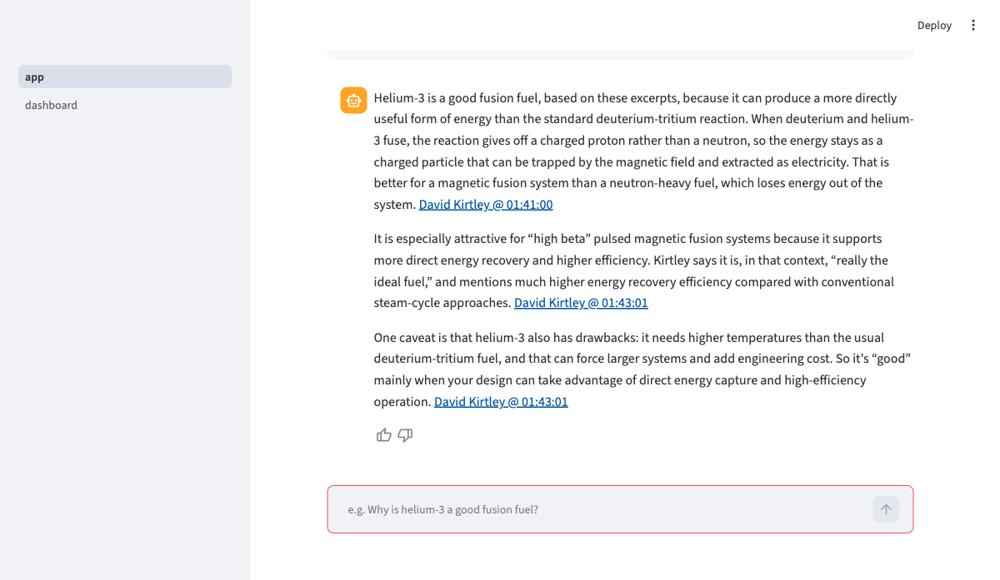
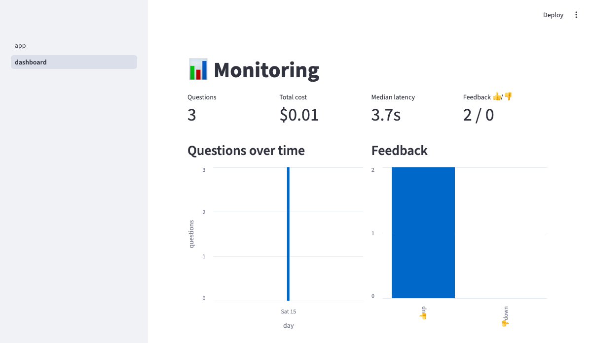

# fusion-rag

Ask three fusion experts anything. A RAG (retrieval-augmented generation)
app over the transcripts of three Lex Fridman podcast episodes about
nuclear fusion — every answer cites the exact moment in the episode, so
you can click through and hear the expert say it.



## The problem

Nuclear fusion is having a moment: private companies promise grid
electricity within a decade while the joke that "fusion is always 30 years
away" refuses to die. Some of the most substantive public conversations
about the state of the field are long-form podcasts — but nobody re-listens
to 8 hours of audio to check what was actually said about, say, helium-3
economics.

fusion-rag turns three of those conversations (~7.7 hours) into a
question-answering app. Ask in plain language; get an answer grounded in
what the guests actually said, with timestamped YouTube links as evidence.

## The corpus

| Episode | Guest | Who they are |
|---|---|---|
| [#112](https://www.youtube.com/watch?v=pDSEjaDCtOU) | Ian Hutchinson | plasma physicist, MIT |
| [#353](https://www.youtube.com/watch?v=aJoRMFWn2Jk) | Dennis Whyte | director, MIT Plasma Science & Fusion Center |
| [#485](https://www.youtube.com/watch?v=m_CFCyc2Shs) | David Kirtley | CEO, Helion Energy |

## How it works

```
ingest (once):  YouTube transcripts ─ drop sponsor segments ─ chunk (2000 chars,
                50% overlap) ─ embed (ONNX all-MiniLM) ─ data/ (committed)

query:          question ─ LLM query rewrite ─ vector search over chunks
                ─ top-5 excerpts into grounded prompt ─ answer with
                [guest @ hh:mm:ss](url) citations ─ log to Postgres
```

- **Knowledge base**: 422 transcript chunks with metadata (episode, guest,
  timestamp, deep-link URL), embedded with all-MiniLM-L6-v2 via ONNX —
  no GPU, no torch, no vector DB (422×384 floats is one numpy matmul).
- **Retrieval**: four variants implemented — keyword (minsearch), vector
  (cosine), hybrid (reciprocal rank fusion), LLM rerank — the app uses the
  eval winner (vector, see below). Because neighboring chunks overlap 50%,
  result lists skip adjacent chunks so the top-5 are distinct passages.
- **Query rewriting**: an LLM rewrites the question for retrieval, mapping
  proper nouns to how captions actually spell them (auto-captions write
  "spark" for SPARC, "Dennis White" for Whyte).
- **LLM**: OpenAI `gpt-5.4-mini` for rewrite, answer, rerank, and the
  evaluation judges. A typical question costs ~$0.004 and takes ~4 s.

## How to run

Prerequisites: Docker (with compose), an OpenAI API key.

```bash
git clone <this repo> && cd fusion-rag
cp .env.example .env          # put your OPENAI_API_KEY in .env
docker compose up --build
```

Open http://localhost:8501 — `app` is the chat, `dashboard` is monitoring,
`database` shows the raw tables. Postgres starts first (healthcheck), the
app waits for it, and tables are created automatically on first use. The
embedding model is baked into the image at build time, so nothing is
downloaded at runtime.

For local development without Docker (needs [uv](https://docs.astral.sh/uv/)
and a Postgres on localhost:5432, e.g. via `docker compose up postgres`
with the port temporarily published):

```bash
uv run --env-file .env streamlit run app.py
```

The ingested data (`data/`) is committed, so you don't need to fetch
anything from YouTube. To reproduce it from scratch anyway:

```bash
uv run -m fusionrag.ingest
```

The script is idempotent: raw transcripts and SponsorBlock responses are
cached in `data/raw/` and reused offline. A quick health check of the whole
pipeline (data integrity, all search variants, one live cited answer):

```bash
uv run --env-file .env smoke.py
```

## Evaluation

### Retrieval

Ground truth: 100 randomly sampled chunks × 3 LLM-generated questions each
(`evals/ground_truth.csv`, 300 pairs). A retrieval counts as a hit if the
source chunk (or its 50%-overlapping neighbor) appears in the top 5.
Reproduce: `uv run --env-file .env evals/retrieval_eval.py`.

| Variant | Hit-rate@5 | MRR@5 |
|---|---|---|
| keyword (minsearch) | 0.553 | 0.465 |
| **vector (cosine)** | **0.787** | **0.623** |
| hybrid (RRF) | 0.740 | 0.557 |
| hybrid + LLM rerank | 0.757 | 0.593 |

**Vector wins and is the app default.** The expected winner was
hybrid+rerank; measurement said otherwise. Keyword search is weak on this
corpus (unpunctuated, misspelling-prone auto-captions vs. naturally worded
questions), and fusing its list in drags hybrid below pure vector — while
vector alone is also the cheapest and fastest variant. The vector-vs-rerank
gap (~3 points on n=300) is within noise; "at least as good, one LLM call
cheaper" decided it.

### Answer quality (LLM-as-judge)

50 ground-truth questions, full RAG run with two prompt styles, judged
0–2 for relevance (judge sees question, answer, and source chunk).
Reproduce: `uv run --env-file .env evals/rag_eval.py`.

| Prompt style | Mean relevance | fully relevant | partial | irrelevant |
|---|---|---|---|---|
| strict grounded | 1.80 | 82% | 16% | 2% |
| **explanatory** | **1.84** | **84%** | 16% | 0% |

The two styles are tied within noise; explanatory (may add brief background,
never beyond the excerpts on facts) is the default.

**Honest limitations**: LLM-generated questions share the source chunk's
topic vocabulary, so absolute numbers flatter all variants — the
*comparison* is fair since every variant faces the same questions. The
judge is the same model family as the answerer (mild self-preference).
Instructing question generation to avoid the chunk's phrasing handicaps
keyword search specifically; real users typing exact jargon would narrow
the keyword-vector gap.

## Monitoring



Every conversation is logged to Postgres (question, rewrite, answer,
retrieved chunks, tokens, cost, latency, retrieval score), and every
answer has 👍/👎 feedback buttons. The dashboard page reads it live:
4 stat tiles plus 6 charts — questions over time, feedback split, latency
distribution, cost per day, episodes cited, retrieval score distribution —
and a recent-conversations table.

## Ingestion details

Fully automated in `fusionrag/ingest.py` (fetch → clean → chunk → embed →
write), one command, idempotent. Ad removal is two-stage: crowdsourced
sponsor segment timestamps from the SponsorBlock API where available, and
a transcript-marker cut (everything before Lex's "and now, dear friends,
here's …") for episodes without SponsorBlock data. Removal is verified —
the sponsor brands read out in #112 don't appear anywhere in the chunks.

## Project layout

```
fusionrag/
  ingest.py     fetch → de-ad → chunk → embed → data/ (idempotent)
  embedder.py   ONNX all-MiniLM wrapper (downloads model on first use)
  search.py     keyword / vector / hybrid / rerank + adjacent-chunk dedup
  rag.py        rewrite → retrieve → cited answer + usage metadata
  db.py         Postgres schema (auto-created) + logging helpers
app.py          Streamlit chat UI with feedback buttons
pages/dashboard.py  monitoring dashboard (6 charts)
evals/          ground truth generator, retrieval + RAG evals, results/
data/           committed transcripts, chunks.json, embeddings.npz
smoke.py        pre-commit pipeline health check
```

## For reviewers (evaluation criteria pointers)

- **Problem description** — this README, top two sections
- **Retrieval flow** — knowledge base + LLM: `fusionrag/search.py`, `fusionrag/rag.py`
- **Retrieval evaluation** — 4 variants compared, winner used: `evals/retrieval_eval.py`, table above
- **LLM evaluation** — 2 prompts × LLM judge, winner used: `evals/rag_eval.py`, table above
- **Interface** — Streamlit UI: `app.py`
- **Ingestion pipeline** — automated script: `fusionrag/ingest.py`
- **Monitoring** — feedback + dashboard with 6 charts: `pages/dashboard.py`
- **Containerization** — everything in docker-compose (app + Postgres with healthcheck): `docker-compose.yml`, `Dockerfile`
- **Reproducibility** — pinned deps (`uv.lock`), committed data, eval scripts re-runnable
- **Best practices** — hybrid search (RRF) evaluated, LLM re-ranking evaluated, query rewriting in the app path

## Attribution

Sponsor segment timestamps come from [SponsorBlock](https://sponsor.ajay.app)
(CC BY-NC-SA 4.0). This project is non-commercial. Transcripts are fetched
with [youtube-transcript-api](https://pypi.org/project/youtube-transcript-api/);
embeddings use [Xenova/all-MiniLM-L6-v2](https://huggingface.co/Xenova/all-MiniLM-L6-v2).
